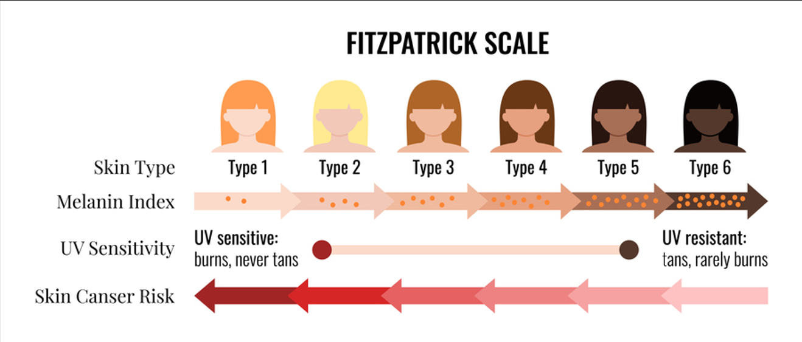
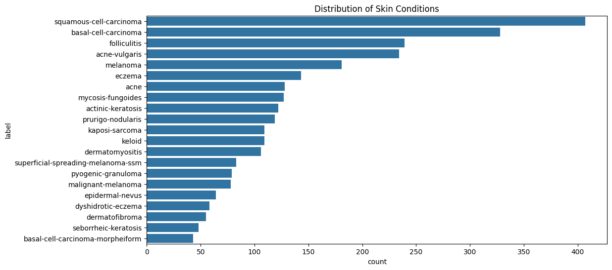
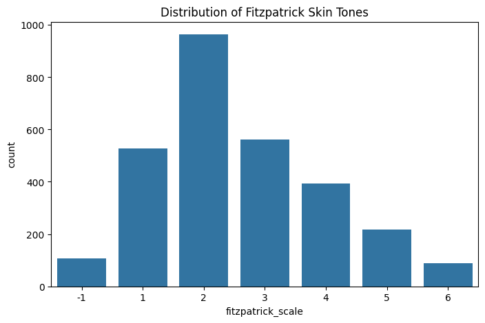
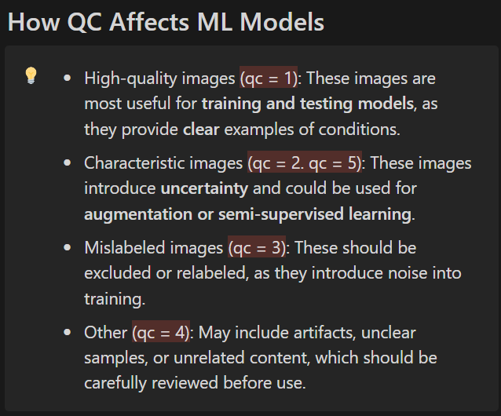
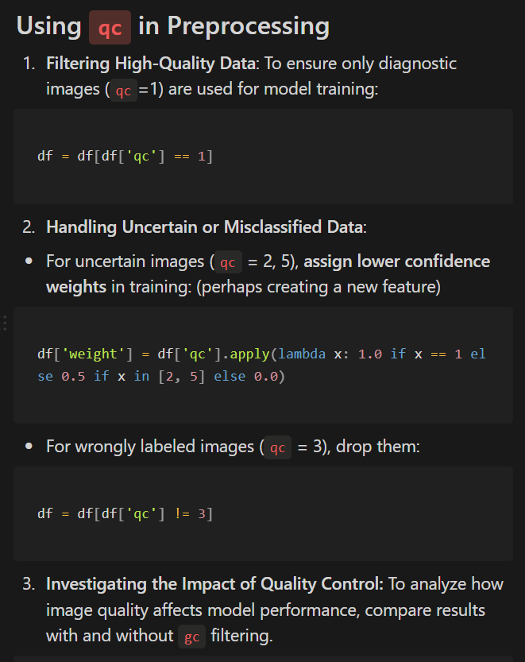
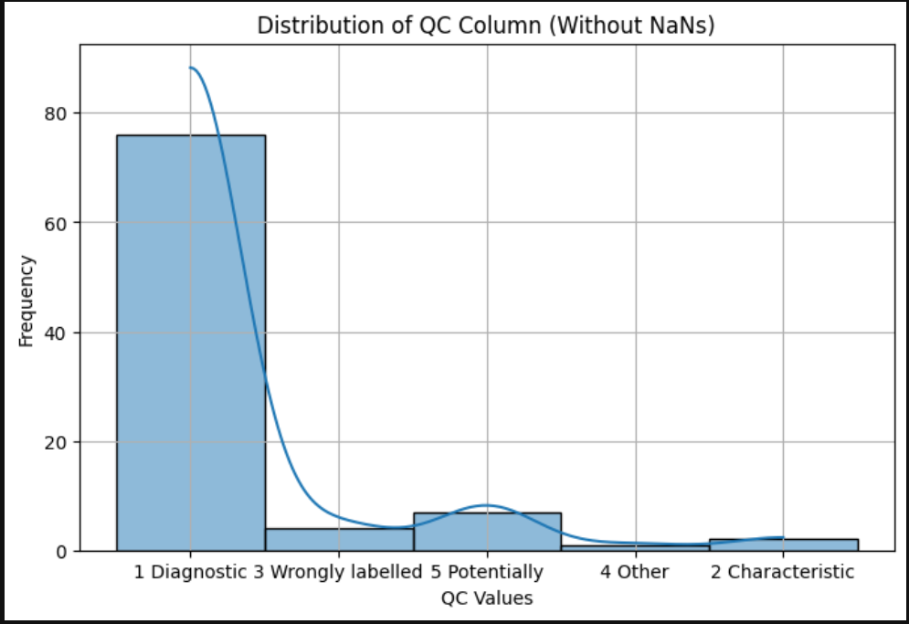
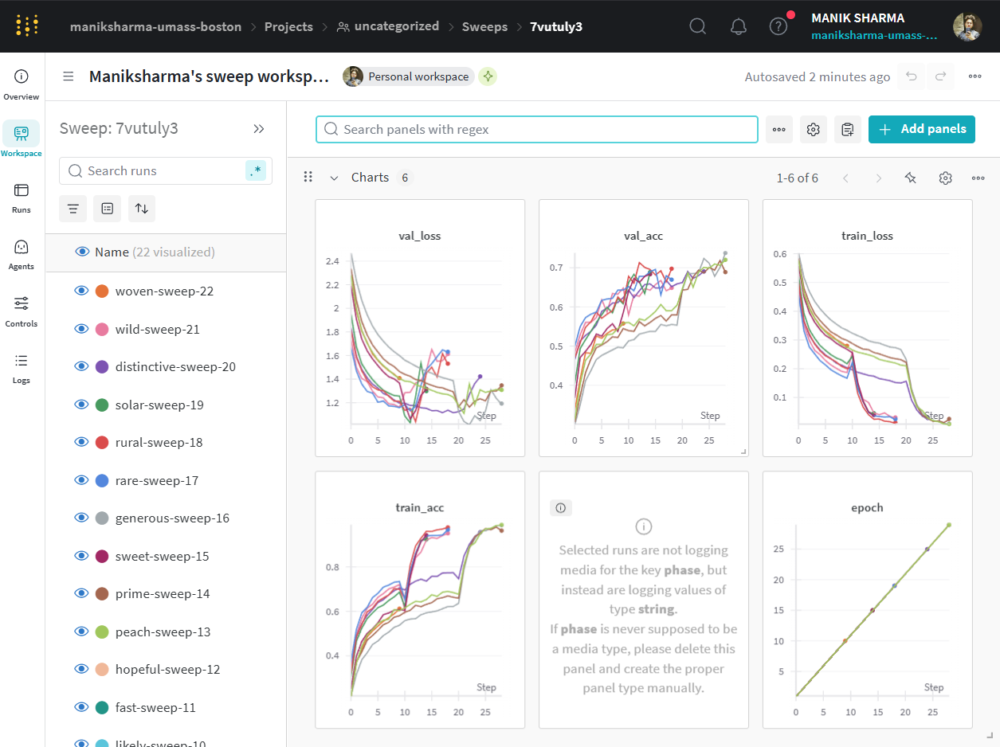
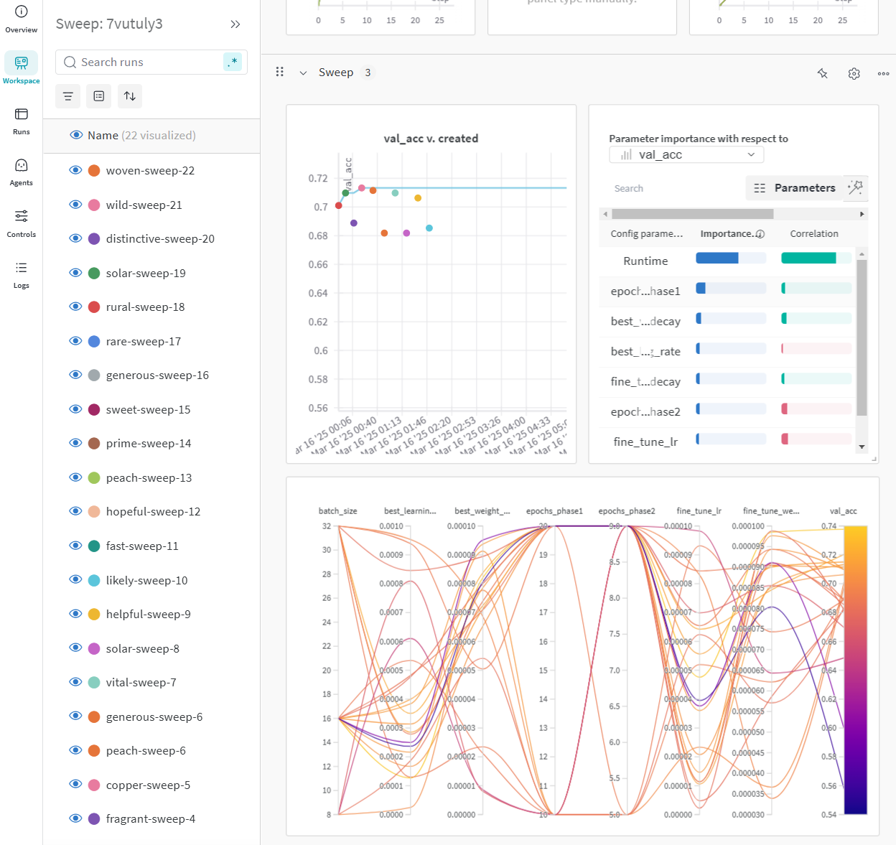

# Dermatology Image Classification with Torch (Kaggle)
## Equitable AI for Dermatology (Spring 2025 AI Studio)
**Goal**: Develop a fair and transparent machine learning model to classify 16 different skin conditions across diverse skin tones, addressing potential biases in dermatology.

## Project Overview 
Skin condition classification models often exhibit bias due to the lack of diverse training data, leading to disparities in healthcare, particularly for individuals with darker skin tones. This project, part of the Spring 2025 AI Studio, aims to create an equitable and explainable model that classifies 16 skin conditions across the Fitzpatrick skin tone scale.
The competition is hosted by Break Through Tech AI and the Algorithmic Justice League (AJL), with an emphasis on equity and transparency in AI-driven healthcare solutions.

### Key Highlights
- **Dataset:** Subset of Fitzpatrick17k (17,000 labeled dermatological images). I specifically used ~4,500 images covering 16 conditions, with Fitzpatrick skin tone (FST) labels (1–6).

- **Fairness Focus:** I tracked performance across diverse FST categories to ensure the model is not disproportionately failing on darker skin types.

- **Model Evolution:** Starting from a simple CNN with SGD → Pre-trained networks (ResNet, EfficientNet) → Transformers (ViT, Swin) → Ensemble.

- **Results:** Achieved up to 0.76 F1 Score on the test set, securing #1 on the leaderboard.

### Dataset Details  
I used a subset of the Fitzpatrick17k dataset, which merges images from DermaAmin and Atlas Dermatologico, plus FST annotations from **Centaur Labs**.
- Image Count: ~4,500 images, each labeled with a skin condition (16 classes).
- Fitzpatrick Scale: A numeric scale (1–6) indicating how skin typically reacts to sun.
  * 1 = Very fair, always burns
  * 6 = Dark brown/black, never burns
- QC (Quality Control) Labels:
  1) Diagnostic: Good example, useful for diagnosis
  2) Characteristic: Possibly indicative but not conclusive
  3) Wrongly labeled: Mislabeled images
  4) Other: Poor image quality or doesn’t fit a category
  5) Potentially Diagnostic: Unclear, needs further testing

 
 
### Fitzpatrick Skin Types (FST)

| Skin type | Typical features                                      | Tanning ability                         |
|-----------|------------------------------------------------------|-----------------------------------------|
| **I**     | Pale white skin, blue/green eyes, blond/red hair     | Always burns, does not tan             |
| **II**    | Fair skin, blue eyes                                 | Burns easily, tans poorly              |
| **III**   | Darker white skin                                    | Tans after initial burn                |
| **IV**    | Light brown skin                                     | Burns minimally, tans easily           |
| **V**     | Brown skin                                          | Rarely burns, tans darkly easily       |
| **VI**    | Dark brown or black skin                            | Never burns, always tans darkly        |
### Distribution of Skin Conditions

### Distribution of Skin Types

### Column Overview

| Column                | Data Type | Kaggle Description                                      | Our Understanding                                       |
|-----------------------|----------|---------------------------------------------------------|---------------------------------------------------------|
| `md5hash`            | Object   | An alphanumeric hash serving as a unique identifier; file name of an image without .jpg | Unique hash value using MD5 hashing algorithm. |
| `fitzpatrick_scale`  | int64    | Integer in the range [-1, 0) and [1, 6] indicating self-described FST *Fitzpatrick Skin Type (FST)* | -1 = Missing/Unlabeled data    1 - 6 = Fitzpatrick skin types   Type 1 = Very fair, burns easily   Type 2 = Deeply pigmented, never burns. |
| `fitzpatrick_centaur`| int64    | Integer in the range [-1, 0) and [1, 6] indicating FST assigned by Centaur Labs, a medical data annotation firm | -1 = Missing/Unlabeled data   1 - 6 = Fitzpatrick skin types   **Difference from `fitzpatrick_scale`**:   1) `fitzpatrick_scale` is self-reported.   2) `fitzpatrick_centaur` is annotated by medical experts. |
| `label`              | Object   | String indicating medical diagnosis; the target for this competition | Medical diagnosis (our target label)   **Example** → melanoma, psoriasis, eczema etc. |
| `nine_partition_label` | Object   | String indicating one of nine diagnostic categories | **Categories**   1. benign-dermal   2. benign-epidermal   3. inflammatory   4. malignant-cutaneous-lymphoma   5. malignant-dermal   6. malignant-epidermal   7. malignant-melanoma |
| `three_partition_label` | Object | String indicating one of three diagnostic categories | **Categories**   1. benign   2. malignant   3. non-neoplastic |
| `qc`                 | Object   | Quality control check by a Board-certified dermatologist.   The `qc` column has responses for 500 observations of the FULL FitzPatrick dataset. Only about 90 observations in the train set have responses, and only about 30 observations in the test set have responses. | **Possible Values**   [nan   '1 Diagnostic'   '2 Characteristic'   '3 Potentially'   '3 Wrongly labelled'   '4 Other']   |
| `ddi_scale`          | int64    | A column used to reconcile this dataset with another dataset (may not be relevant).   | Used to merge another dataset with our Fitzpatrick dataset. Mostly ignored in this project. |

> [!NOTE]
> The dataset is provided as train.csv (with labels) and test.csv (unlabeled for submission). Image files are stored in an images.zip archive, with train/test splits structured into folders.

### QC Labels

| Code | Label                 | Meaning                                                                 | Count |
|------|-----------------------|-------------------------------------------------------------------------|-------|
| 1    | **Diagnostic**         | The image provides a **good example** of the skin condition and is **useful for diagnosis**. | 348   |
| 2    | **Characteristic**     | The image **may show** the skin condition, but **isn't conclusive** for diagnosis. | 32    |
| 3    | **Wrongly labeled**    | The image **does not correspond** to the labeled condition; it was **misclassified**. | 17    |
| 4    | **Other**              | The image does **not fit any specific category**, possibly due to **image quality issues**. | 10    |
| 5    | **Potentially Diagnostic** | The image is **unclear**, meaning **further testing** is needed to confirm its diagnostic value. | 97    |

### Handling `qc` Values 
#### Here's the distibution of the `qc` column across the Fitzpatrick scale:

## Data Loading and Preprocessing

_Loading the data from train.csv and test.csv:_  
- Added .jpg extension to each md5hash.  
- Constructed file_path: combined label + md5hash to form the image’s directory path (e.g. eczema/ecze1234.jpg).  
- Verified images exist on disk using a custom check function (`check_image_paths`).

### Handling Missing Data and Invalid Data 

_Missing Images: Logged them, removed from training if crucial._  
- Missing / -1 Fitzpatrick Values: Replaced `fitzpatrick_scale` with `fitzpatrick_centaur` if possible.  
- `qc` Column: Extracted numeric part (1–5) to create a qc_numeric column.  
- Assigned a custom sample weight for each numeric code.  
  - Ex. `1 => 1.0`, `5 => 0.8`, `3 => 0.0` (wrongly labeled). 

### Encoding Labels and Partition Columns 
- **Label Encoding**: Mapped each of the 16 diseases to an integer using `LabelEncoder()`.  
- **Partition Columns**: `nine_partition_label_encoded` & `three_partition_label_encoded` also label-encoded.  
- **Final DataFrame**: Merged features into `df_train` with columns like `file_path`, `fitzpatrick_scale`, `sample_weight`, `label` (int).

### Custom Transformations & Data Augmentation using TorchVision
- Baseline Transform (mild rotation, slight color jitter) 
- Minority Transform (heavier rotation, flips, brightness changes) for underrepresented classes (fewer than 100 samples) 
- Validation Transform (only resize + normalize) 
- PyTorch `Dataset` classes read each image from disk, convert BGR → RGB, apply the appropriate transform, and return `(image_tensor, label, sample_weight)`

## Model Architecture & Training  

#### 1. Initial CNN & Basic Approach  
- Started with a simple CNN and SGD.  
- Achieved modest accuracy but recognized the complexity of multi-class dermatology data.  

#### 2. Pre-trained Models and Transformers (Swin and ViT)  
- **`SwinForImageClassification` and `VITForImageClassification` from Hugging Face:**  
  - Imported one of the following variants:  
    - `"microsoft/swin-large-patch4-window7-224-in22k"`  
    - `"google/vit-large-patch16-224-in21k"`  
  - Set `num_labels=21`.  

- **Phased Training:**  
  - **Phase 1:** Freeze the Swin backbone and train only the classification head.  
  - **Phase 2:** Unfreeze the entire model with a lower learning rate (LR).  

Optimizer: `AdamW` with a carefully tuned learning rate & weight decay (discovered via Weights & Biases sweeps).  
Loss: Weighted cross-entropy, multiplied by `sample_weight` from the `qc` column.

## Results and Overfitting Checks  

- **Training:**  
  - **Phase 1:** ~10 epochs with the backbone frozen.  
  - **Phase 2:** ~7 epochs unfreezing everything.  

- **Validation:**  
  - Achieved ~0.69 F1 Score in these final runs.  
  - Monitored potential overfitting with a validation DataLoader; early stopping was possible if accuracy plateaued.  

## Ensembling 
After training various Swin and ViT models separately, we created an ensemble to further boost classification performance. Each model produced a set of logits for each image, which we combined through weighted averaging. We tested the ensemble on a validation split by comparing ensemble predictions with ground-truth labels, achieving a higher accuracy than any single model alone.  
#### **Achieved an F1 Score of 0.76, making us number 1 on Kaggle**

### Weights and Biases Hyperparameter Tuning 
We used W&B to find optimal:  

### Hyperparameters

- Learning Rate - Coarse sweeps in {1e-4, 1e-5, etc.}
- Weight Decay - mostly 0.5 was best
- Batch Size - 16, 32, or 64
- Dropout Rate

**Example**: The final chosen LR was 0.0001076695, weight decay 0.0000170455, discovered from a Bayesian sweep. These settings significantly improved validation performance.
 

## Final Inference & Submission
- Test Data: Created a test transform (resize + normalize). 
- Iterated over test.csv, loaded each image, and performed a forward pass.
- Argmax over the logits to pick the predicted label integer. 
- Mapped integer back to the original disease string (idx_to_label). 
- Saved as submission_75_initial.csv with columns [md5hash, label]. 
- This final submission reached 0.76 F1 Score on the leaderboard.

# Conclusion
We built a robust pipeline to handle data cleaning, augmentation, and weighting. By combining advanced transformer architectures (Swin and VIT) with phase-wise training and hyperparameter sweeps in W&B, we achieved a strong 0.76 F1 Score. This demonstrates the potential of attention-based models for dermatology classification, while also emphasizing fairness for different skin tones.
